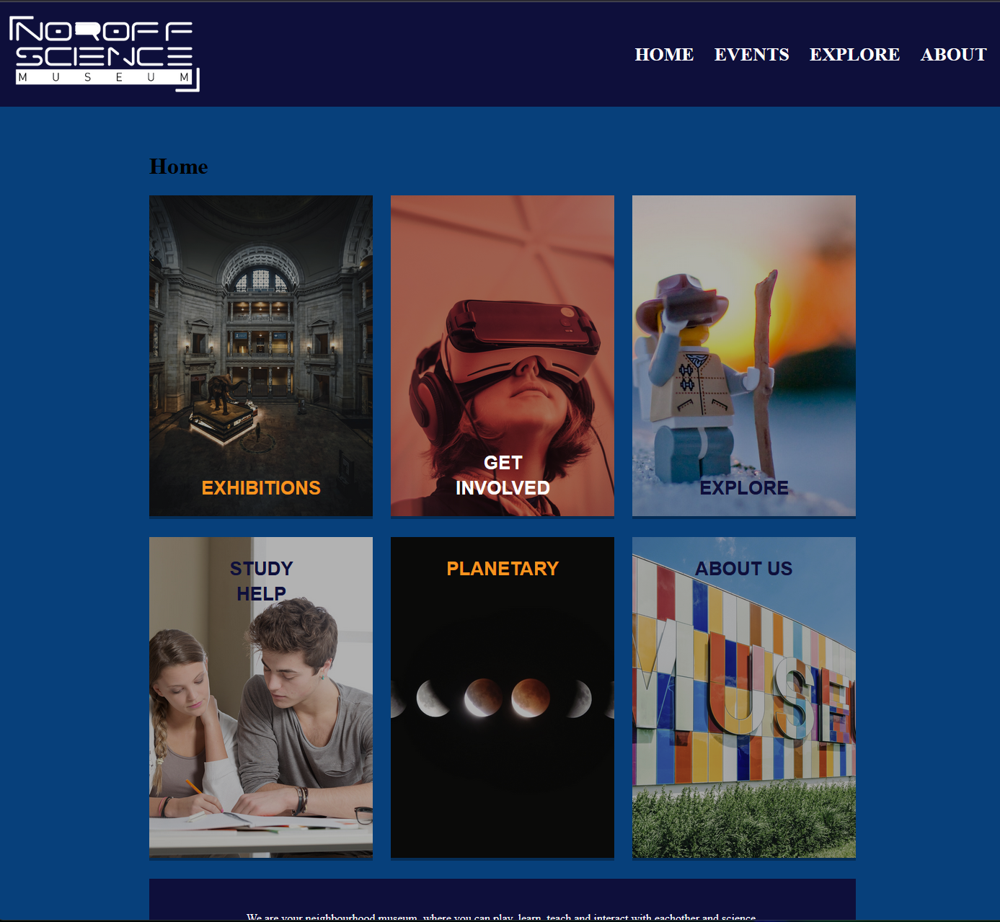

# Cross Course Project

---



## Description
This one of the first projects I worked with, where it was a cross course over two submissions.
First part were done in Figma, last part was to set everything up. 

---

## Built With
- HTML
- CSS
- Figma

---

## Live Demo
You can view the live portfolio [here](https://sparkling-alpaca-18c2b2.netlify.app).

---

## Installation
To run the project locally:
git clone https://github.com/Noroff-FEU-Assignments/cross-course-project-RaddishAI.git

1. Clone the repository:
   ```bash
   git clone https://github.com/Noroff-FEU-Assignments/cross-course-project-RaddishAI.git

---

## Contact Me

- [LinkedIn](https://www.linkedin.com/in/petter-r%C3%B8nning-80602613a/)
- [Portfolio](https://raddishaisportfolio.netlify.app/)
- [Email](mailto:petter.arbeid@gmail.com)

---
